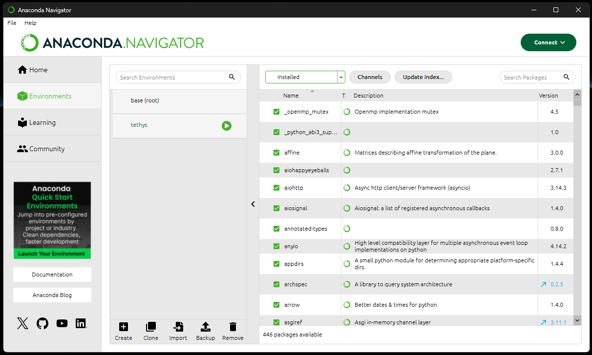
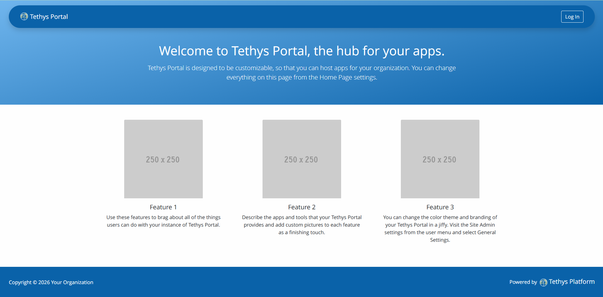
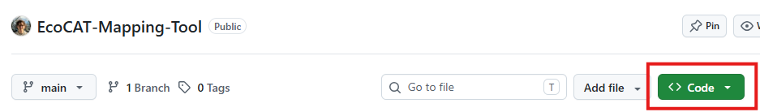
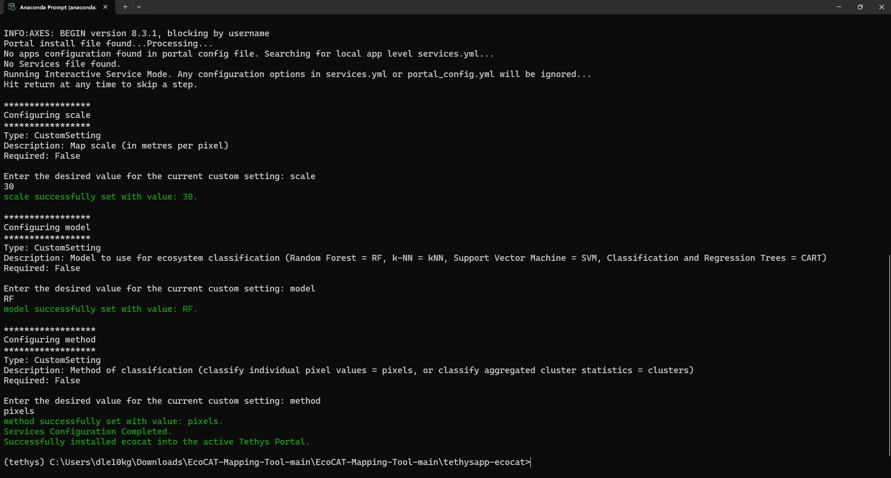
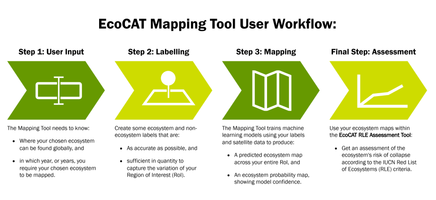
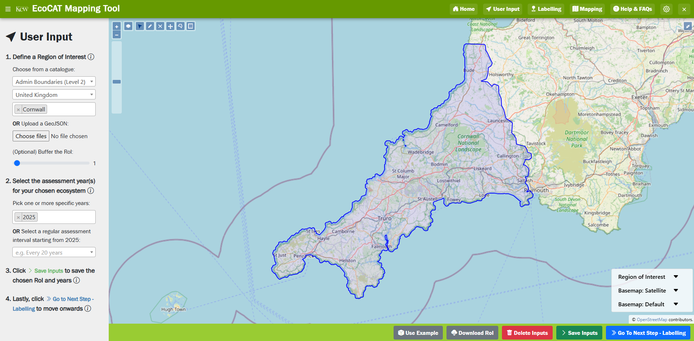
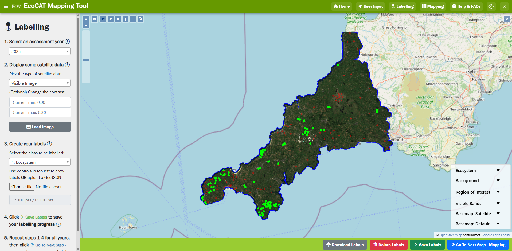

# EcoCAT Mapping Tool

## A user-friendly web-app for automated time-series ecosystem mapping using satellite data and machine learning

<video alt="Demonstration of the EcoCAT Mapping Tool on Cornish Lowland Heathland" width="100%" height="auto" controls>
    <source src="images/EcoCAT_Demo.mp4" type="video/mp4">
</video>

**Figure 1:** A fly-through of the EcoCAT Mapping Tool being used to map Lowland Heathland in Cornwall, United Kingdom.

## 1. Introduction

The loss of biodiversity and degradation of natural habitats are making ecosystems increasingly vulnerable to collapse. Healthy ecosystems are essential for human and planetary well-being, sustaining services such as clean air and water, climate regulation, nutrient cycling, crop pollination, and recreation.

Ecosystems encompass communities of interacting species and their physical environment. They can be (i) classified using the [Global Ecosystem Typology](https://global-ecosystems.org/), which standardises categories of ecosystems based on function and composition, and (ii) assessed following the [IUCN Red List of Ecosystems criteria](https://iucnrle.org/rle-categ-and-criteria), which ranks ecosystems according to their risk of collapse. Together, these products provide a global framework for monitoring ecosystem status.

The IUCN Red List of Ecosystems protocol involves mapping, quantifying distribution changes, and estimating degradation severity and extent, following science-backed foundations (Red List of Ecosystems guidelines). It has been adopted as a headline indicator in the Global Biodiversity Framework (GBF) of the UN Convention on Biological Diversity, attesting to its global relevance as an indicator for ecosystem monitoring.

We aim to develop [EcoCAT (Ecosystem Conservation Assessment Tools)](https://www.kew.org/science/our-science/projects/EcoCAT) as an open, flexible, and modular application to map ecosystem distribution and time-series trends, and assess ecosystem degradation and risk of collapse, following the guidelines of the IUCN Red List of Ecosystems. We will build on our team’s expertise with the species assessment tool [GeoCAT](geocat.iucnredlist.org), a geospatial conservation assessment tool developed by Kew, to create an analogous application for ecosystem risk assessment.

EcoCAT will provide tools and workflow to facilitate the application of the IUCN Red List of Ecosystems criteria, equipping conservation practitioners, scientists and environmental organisations with a much-needed application to harness Earth Observation and next-generation big data to assess and monitor ecosystems, supporting global efforts to track progress towards GBF’s goals.

## 2. Visit the EcoCAT Mapping Tool Web Page

A deployed version of the EcoCAT Mapping Tool is currently in development, wherein users will be able to navigate to a web-page hosting the tool without the need for local installation. Another benefit to a version deployed to the cloud will be the ability to use the EcoCAT project's Google Earth Engine (GEE) service account, meaning that user's will not need a personal GEE cloud project to use the tool. Any exported ecosystem maps will also be exported to EcoCAT's Google Cloud Storage for download, as opposed to being exported to the user's Google Drive. Please 'Watch' this repository for an update on when this is available.

## 3. Installing the EcoCAT Mapping Tool Locally

### 3.1. Set Up a Python Virtual Environment

#### **3.1.1. Install Anaconda or Miniconda:**

Anaconda is a service that aims to make creating and managing Python projects as simple as possible. Along with a distribution of Python itself, Anaconda provides 'conda' - a Python package and environment manager that handles the installation, dependancy-resolving and updating of Python software for you. It can also separate your projects into different environments so that if a package is installed, updated or removed in one, it doesn't break another.

Go to the [Anaconda installation web-page](https://www.anaconda.com/docs/getting-started/installation) to find the right Anaconda distribution for you based on your operating system and confidence with Python package managers and command line interfaces (CLIs).

You can choose to install Anaconda, which comes with the conda package manager, 600+ Python packages pre-installed and the Anaconda Navigator (**Figure 2**). Or you can install Miniconda, which is a minimal version of Anaconda that comes with conda and a few essential packages.

Recommended installers can be downloaded using the links below:

- For Windows: https://repo.anaconda.com/archive/Anaconda3-2026.07-1-Windows-x86_64.exe

- For Linux: https://repo.anaconda.com/archive/Anaconda3-2026.07-1-Linux-x86_64.sh

- For Mac: https://repo.anaconda.com/archive/Anaconda3-2026.07-1-MacOSX-arm64.pkg


**Figure 2:** The Anaconda Navigator on Windows 11, showing the conda environment called 'tethys' that is created in the next step.

#### **3.1.2. Create a conda environment:**

On Windows, search for 'Anaconda Prompt' in the start menu and open it. Anaconda Prompt is a CLI for Windows versions of Anaconda and Miniconda. Or to save having to open the start menu each time, you can follow the video below (**Figure 3**) to make Anaconda Prompt your default terminal. For Linux and Mac users, open the terminal.

<video alt="Screen-recording of process of opening an Anaconda Prompt" width="100%" height="auto" controls>
    <source src="images/Anaconda_Prompt.mp4" type="video/mp4">
</video>

**Figure 3:** The process of opening a terminal, setting the default terminal to an Anaconda Prompt, and then checking the conda version on Windows 11.

Verify that your installation of conda has worked by typing out and running the following in the Anaconda Prompt/terminal to see which version you have installed.

```bash
conda --version
```

The next step is to create a new conda environment into which we can install the Tethys Platform, Google Earth Engine's Python API and other essential packages. By running the following, we will create a new enviroment called `tethys`. You may need to type 'Y' or 'y' and press enter to confirm.

```bash
conda create -n tethys
```

Lastly, we need to activate this new conda enviroment to place us within it, as currently we are in the `base` environment.

```bash
conda activate tethys
```

If the `tethys` environment is not activated before any Tethys commands are run later on, you will receive an error something like `'tethys' is not recognized as an internal or external command, operable program or batch file.` for Windows or `sh: tethys: command not found` for Linux.

### 3.2. Installing the Tethys Platform

[Tethys](https://docs.tethysplatform.org/en/stable/index.html) is a platform that can be used to develop and host geoscientific web apps. It includes a suite of free and open source software (FOSS) that has been carefully selected to address the unique development needs of geoscientific web apps. Tethys web apps are developed using a Python software development kit (SDK) which includes programmatic links to each software component. Tethys Platform is powered by the Django Python web framework giving it a solid web foundation with excellent security and performance.

Once the `tethys` environment has been activated, the Tethys Platform can be installed by running the following in the Anaconda Prompt/terminal. As before, you may need to type 'Y' or 'y' to confirm the installation or updating of any dependancies.

```bash
conda install -c conda-forge tethys-platform
```

We can check that the Tethys Platform has installed properly by running the following in the Anaconda Prompt/terminal. This should bring up the Tethys Portal - the home of all of your installed Tethys apps (**Figure 4**). If not, navigate to [http://127.0.0.1:8000/](http://127.0.0.1:8000/) in a browser. To log in for the first time, the default username and password is 'admin' and 'pass'.

```bash
tethys quickstart
```


**Figure 4:** The default Tethys Portal, which hosts all of your installed Tethys Apps, such as the EcoCAT Mapping Tool.

### 3.3. Clone the GitHub Repository

The next step is to download the entire directory of the EcoCAT Mapping Tool's files and scipts to wherever you like on you local computer. You can download the directory as a .zip file directly from GitHub by clicking the green '<> Code' button (**Figure 5**), which can then be extracted at the desired location. Or you can run the following in the Anaconda Prompt/terminal if you have Git installed.

```bash
git clone https://github.com/dlecorre387/EcoCAT-Mapping-Tool.git
```


**Figure 5:** The header of the EcoCAT Mapping Tool GitHub repository, which can be downloaded as a .zip file by clicking the green '<> Code' button highlighted in red.

### 3.4. Install the EcoCAT Mapping Tool to your Tethys Portal

In the Anaconda Prompt/terminal, we need to make sure that the current directory that we are in is the folder that contains the EcoCAT Mapping Tool app files that were just downloaded/cloned from its GitHub repository. This folder should be called `tethysapp-ecocat` and we can change into that directory in a couple of ways:

- By progressively running `cd folder` in the Anaconda Prompt/terminal to change from our current directory into a directory called `folder` until we reach `tethysapp-ecocat`. You can jump several directories at once if you know the path (e.g. `cd path/to/sub/folder`), or move up a directory by running `cd ..` if you enter the wrong folder. NOTE: Directories are separated with forward slashes (\\) on Windows, but with back slashes (/) on Linux and Mac.
- On Windows, we can right click on the folder in the 'File Explorer' and click 'Open in Terminal' to open an Anaconda Prompt/terminal where the present working directory is the folder right-clicked on.

Once we are in the `tethysapp-ecocat` folder, your Anaconda Prompt/terminal should look something like:
- On Windows: `(tethys) C:\Users\username\path\to\tethysapp-ecocat>`
- On Linux: `(tethys) username:path/to/tethysapp-ecocat$`

Lastly, we can run the following command in the Anaconda Prompt/terminal to begin installing the EcoCAT Mapping Tool to you Tethys Portal, along with all of its dependancies and settings.

```bash
tethys install
```

You will be asked to choose values for some custom settings (see **Figure 6**), which are:
- **scale:** The map scale of the ecosystem maps in metres per pixel. A smaller 'scale' will result in a higher resolution ecosystem map, but will increase the computational cost. The minimum value that can be set is 30, but we recommend a value of 100.
- **model:** The type of machine learning model used to classify the ecosystem. This can be one of RF (random forest), kNN (k-nearest neighbour classifier), SVM (support vector machine), or CART (classification and regression trees). We recommend setting 'model' to RF.
- **method:** The method of classification to be used. Can be one of pixels (for classifying each pixel individually), or clusters (for applying simple non-iterative clustering to separate the region into smaller parcels, and then classifying each parcel as a whole). We recommend setting 'method' to pixels as the clustering approach is experimental and has a display issue when changing zoom levels.


**Figure 6:** Contents of the Anaconda Prompt having just run `tethys install` within the `tethysapp-ecocat` folder, showing the user being queried for values for some custom settings.

### 3.5. Setting Up Google Earth Engine (GEE)

In order to access the cloud computing facilities and satellite datasets within Google Earth Engine (GEE), we will need access to a Google Cloud project that:

- has the Earth Engine API enabled,
- is registered for commercial or noncommercial use, and
- grants you (or the user) the correct roles and permissions.

#### **3.5.1. Creating a Google Cloud Project**

If you do not have a Google Cloud Project yet, you can create one by going to the [Google Cloud Console](https://console.cloud.google.com/), logging in with your Google account, and clicking 'Select Project' - 'New Project'.

#### **3.5.2. Registering a Google Cloud Project with GEE**

Once you have created a new Google Cloud Project, or if you already have one that is not registered to access GEE, visit the [registration page](https://console.cloud.google.com/earth-engine/welcome) within the Earth Engine section of Google Cloud Console. Here, you can register your project for 'commercial' or 'non-commercial' use of GEE. Most use cases of non-commercial use, such as non-profit, teaching, research or journalism, are free-of-charge.

#### **3.5.3. Authenticating GEE**

Now that you have created a Google Cloud Project that has access to the GEE Python API, or if you already had one to start with, we need to authenticate it before running the EcoCAT Mapping Tool. This can be done using the GEE command line tool `earthengine` by running the following in an Anaconda Prompt/terminal (with the `tethys` environment activated) before starting the EcoCAT Mapping Tool (with `tethys start`, see the next section).

```bash
conda activate tethys
earthengine authenticate
```

You also need to explicitly set the project (replace `my_project` with the name of your GEE Cloud Project) that is being authenticated for future calls of `tethys start`.

```bash
earthengine set_project my_project
```

### 3.6. Running the EcoCAT Mapping Tool

Every time that we want to start the EcoCAT Mapping Tool, we need to make sure that the `tethys` conda environment is the current active environment. Then we can (finally!) start the EcoCAT Mapping Tool by running the following in the Anaconda Prompt/terminal to start the Tethys Portal. This will open a web-page, but if not, navigate to http://127.0.0.1:8000/ in a browser. You will then be able to log in with the default details (username: admin, password: pass) to begin using the tool.

```bash
conda activate tethys
tethys start
```

## 4. How to Use the EcoCAT Mapping Tool


**Figure 7:** Diagram of the user workflow through the EcoCAT Mapping Tool - from defining the necessary user input, to labelling their ecosystem/non-ecosystem, and producing their ecosystem maps.

### 4.1. User Input

In this page (**Figure 8**), users provide the EcoCAT Mapping Tool with knowledge of where the ecosystem is geographically, as well as when it should be mapped.

1. **Define a Region of Interest (RoI):**

    In order to perform a risk assessment, we need to know where the ecosystem is geographically by providing a RoI that encapsulates it. This can be hand-drawn on the map, perhaps as a box or polygon around all known units. It can also be uploaded to the tool (as a GeoJSON in EPSG:4326) if you already have a boundary that you would like to use as the RoI. A RoI can also be selected from a series of catalogues (such as country boundaries or RESOLVE Ecoregions) hosted on Google Earth Engine. The drawn, uploaded, or selected RoI can then be buffered (in kilometres) if required.
            
2. **Select your ecosystem assessment year(s):**
    
    To determine the change in the ecosystem's extent over time, we also need to know which years it should be assessed within. If you not performing a risk assessment and, therefore, may only require a single map, then a specific year can be chosen. If you are performing a risk assessment, then multiple years can be chosen from a drop-down, or assessment years can be generated automatically by using a regular assessment interval (e.g. every 10 years) starting from 2025.


**Figure 8:** The 'User Input' page of the EcoCAT Mapping Tool, showing the RoI and assessment year selection steps. This example shows Cornwall, United Kingdom (not including the Isles of Scilly) buffered by 1km being used as the RoI, with 2025 as the sole chosen assessment year.

### 4.2. Labelling

In this page (**Figure 9**), users employ their expert knowledge of their chosen ecosystem to label it through time using temporally-explicit satellite data.

1. **Pick one of your selected assessment years:**
    
    Choose one of the assessment years that you selected in the 'User Input' page to begin the process of labelling. These labels will be used to build a dataset of pixel values (such as colour, vegetation health, topography) to train a machine learning model to map the ecosystem within the RoI.
            
2. **Display some satellite data:**

    To help with the labelling process, it will be necessary to load some satellite data (e.g. imagery, spectral indices, topography) that are correct as of this chosen assessment period. For example, if we are labelling 1985, we need to make sure that any pixels labelled as ecosystem were genuinely taken as close to 1985 as possible.
            
3. **Draw or upload your ecosystem and non-ecosystem background labels:**
                
    Pixels can be labelled as ecosystem or non-ecosystem background (such as urban areas, water bodies, other vegetation etc.) using points (i.e. individual pixels) or as polygons (i.e. several pixels at a time) by using the drawing controls in the top left of the map. Otherwise, you can upload ecosystem or background labels separately as GeoJSONs (in EPSG:4326).
            
4. **Repeat for all assessment years:**

    This labelling process needs to be repeated for all of your chosen assessment periods, as a separate machine learning model will be trained for each year.


**Figure 9:** The 'Labelling' page of the EcoCAT Mapping Tool, showing 200 points dropped evenly on pixels covering Lowland Heathland and non-ecosystem background (e.g. agriculture, urban areas, water bodies) in Cornwall, United Kingdom. The image shown here is a median composite of Sentinel-2 visible bands for 2025.

### 4.3. Mapping

In this page (**Figure 10**), the EcoCAT Mapping Tool will retrieve the spectral signature of what is, and what isn't, ecosystem from satellite data from the chosen assessment year using the labels produced in the previous step. This information is then used to train machine learning models to map the entire RoI for ecosystem. The source of the satellite data used for training and mapping depends on when the assessment year occurs. For 2017-2025, we use Google's AlphaEarth satellite embeddings. For 1983-2016, we build a composite of Landsat visible bands, spectral indices and topography. For 2000-2025, if the user's chosen RoI is so large that a coarse map scale (over 500 metres per pixel) must be used, then we instead build a composite of MODIS visible bands, spectral indices and topography.

1. **Pick one of your assessment years:**
    
    Again, start by picking one of your assessment years to begin the process of mapping your ecosystem.
     
2. **Display some satellite data:**
                
    Similar to the 'Labelling' page, satellite data correct as of the chosen assessment year can be displayed on the map to help validate your ecosystem map and to see if and where more ecosystem labels may be required.
            
3. **Classify the ecosystem:**
                
    By clicking the 'Classify Ecosystem' button, you will start training a machine learning model (default is a Random Forest) on the labels that you made for this assessment year. This trained model will then be used to classify all pixels within your RoI as either ecosystem or non-ecosystem background. The resulting ecosystem map will be displayed on-screen, along with the ecosystem probabilities (i.e. the model's confidence from 0-100% that a given pixel is ecosystem).
            
4. **Export your ecosystem map:**
                
    Once you are happy with the result of your ecosystem map for this assessment year, you can export it from the Google Earth Enging (GEE) servers to Google Cloud Storage, from which it can be downloaded once the export is complete. NOTE: To preserve usage allocations within GEE, exporting is currently limited to select users in this version of the EcoCAT Mapping Tool.
            
5. **Repeat for all assessment periods:**
                
    Whilst you are waiting for your ecosystem map to finish exporting, you can repeat this process for you other assessment years.

<video alt="Screen-recording of the 'Mapping' page" width="100%" height="auto" controls>
    <source src="images/Mapping.mp4" type="video/mp4">
</video>

**Figure 10:** The 'Mapping' page of the EcoCAT Mapping Tool, showing a map of Lowland Heathland in a region of Cornwall, United Kingdom. The map is blinked to show the ecosystem units underneath, and the ecosystem probability map (high and low probabilities are green and red, respectively) is also displayed.

### 4.4. (Optional) Perform Ecosystem Risk Assessment using the EcoCAT RLE Assessment Tool

As part of the EcoCAT project, we have also been developing a web-page that allows users to perform IUCN Red List of Ecosystems (RLE) guided assessments of the collapse risk for their ecosystem. By inputting the time-series maps created through the use of the EcoCAT Mapping Tool, or any maps that may already exist, the EcoCAT RLE Assessment Tool can give conservation practioners, researchers or policy makers an indication of the threat posed to their ecosystem of choice.